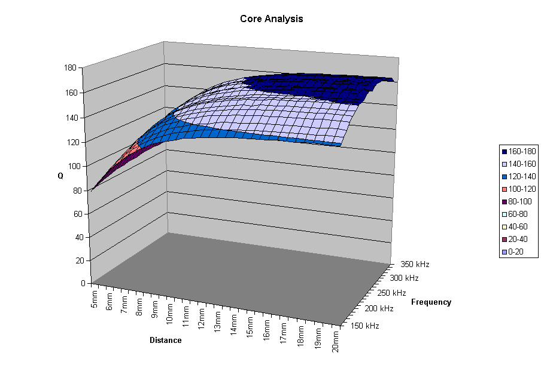

<div align="center">

## Build 3D chart in Excel from 3D array


</div>

### Description

This function takes a three dimensional array of data with four parameters to track trends as they vary along two variables, opens a new instance of Excel, enters the data in three Excel worksheets, then creates charts of one of the data sets. One chart is a three dimensional surface type. In this case, it was desired to show the Q of an inductive winding at differing frequencies and with a metal target at varying distances from the winding.
 
### More Info
 
A three dimensional array. In this case, the first dimension is set as [Distance],[Frequency],[Q],[Inductance],and [dQ/dResistance]. The distance parameter varies along the second dimension, and the frequency parameter varies along the third dimension.

The function does not return any values - error checking should be added to return a boolean indicating if any errors occurred.


<span>             |<span>
---                |---
**Submitted On**   |
**By**             |[Oliver French](https://github.com/Planet-Source-Code/PSCIndex/blob/master/ByAuthor/oliver-french.md)
**Level**          |Intermediate
**User Rating**    |5.0 (65 globes from 13 users)
**Compatibility**  |VB 4\.0 \(32\-bit\), VB 5\.0, VB 6\.0, VBA MS Excel
**Category**       |[Microsoft Office Apps/VBA](https://github.com/Planet-Source-Code/PSCIndex/blob/master/ByCategory/microsoft-office-apps-vba__1-42.md)
**World**          |[Visual Basic](https://github.com/Planet-Source-Code/PSCIndex/blob/master/ByWorld/visual-basic.md)
**Archive File**   |[](https://github.com/Planet-Source-Code/oliver-french-build-3d-chart-in-excel-from-3d-array__1-36512/archive/master.zip)


### Source Code

```
' ********************************************************************************
' ********************************************************************************
' **  Save and chart a 3D array of data in excel               **
' ********************************************************************************
' ********************************************************************************
Public Function Chart3DArray(varData As Variant)
  Dim xlApp As Excel.Application
  Dim xlBook As Excel.Workbook
  Dim xlQSheet As Excel.Worksheet
  Dim xlLSheet As Excel.Worksheet
  Dim xlRSheet As Excel.Worksheet
  Dim SFile As String
  Dim intQStartRow As Integer
  Dim intDQStartRow As Integer
  Dim intLStartRow As Integer
  Dim intRStartRow As Integer
  Dim xl3DChart As Excel.Chart
  Dim xl2DChart As Excel.Chart
  Dim d%, f%
  Set xlApp = New Excel.Application  ' Create new instance of excel
  xlApp.Visible = False
  Set xlBook = xlApp.Workbooks.Add
  ' Name sheets
  xlBook.Sheets("Sheet1").Name = "Q"
  xlBook.Sheets("Sheet2").Name = "L"
  xlBook.Sheets("Sheet3").Name = "R"
  ' Load sheet objects
  Set xlQSheet = xlApp.Worksheets("Q")
  Set xlLSheet = xlApp.Worksheets("L")
  Set xlRSheet = xlApp.Worksheets("R")
  ' Load start row variables to keep track of which row data is being entered in
  intQStartRow = 3
  xlQSheet.Cells(intQStartRow - 2, 1) = "Q Data"
  intDQStartRow = UBound(varData, 2) + intQStartRow + 4
  xlQSheet.Cells(intDQStartRow - 2, 1) = "dQ/dD (Slopes are calculate over 1mm intervals)"
  intLStartRow = 3
  xlLSheet.Cells(intLStartRow - 2, 1) = "L Data (mHenries)"
  intRStartRow = 3
  xlRSheet.Cells(intRStartRow - 2, 1) = "R Data (ohms)"
  ' Populate sheet with data
  For d% = 0 To UBound(varData, 2)
    xlQSheet.Cells(d% + intQStartRow, 1) = varData(0, d%, 0) & "mm"
    xlQSheet.Cells(intDQStartRow + d%, 1) = varData(0, d%, 0) & "mm"
    xlLSheet.Cells(d% + intLStartRow, 1) = varData(0, d%, 0) & "mm"
    xlRSheet.Cells(d% + intRStartRow, 1) = varData(0, d%, 0) & "mm"
  Next d%
  For f% = 0 To UBound(varData, 3)
    xlQSheet.Cells(intQStartRow - 1, 2 + f%) = varData(1, 0, f%) & "kHz"
    xlQSheet.Cells(intDQStartRow - 1, 2 + f%) = varData(1, 0, f%) & "kHz"
    xlLSheet.Cells(intLStartRow - 1, 2 + f%) = varData(1, 0, f%) & "kHz"
    xlRSheet.Cells(intRStartRow - 1, 2 + f%) = varData(1, 0, f%) & "kHz"
    For d% = 0 To UBound(varData, 2)
      xlQSheet.Cells(d% + intDQStartRow, 2 + f%) = varData(5, d%, f%)
      xlQSheet.Cells(d% + intQStartRow, 2 + f%) = varData(2, d%, f%)
      xlLSheet.Cells(d% + intLStartRow, 2 + f%) = varData(3, d%, f%)
      xlRSheet.Cells(d% + intRStartRow, 2 + f%) = varData(4, d%, f%)
    Next d%
  Next f%
  ' Plot 3d Chart of Q
  xlApp.Charts.Add
  Set xl3DChart = xlApp.ActiveChart
  xl3DChart.SetSourceData Source:=xlBook.Sheets("Q").Range(xlQSheet.Cells(intQStartRow, 1), _
    xlQSheet.Cells(intQStartRow + UBound(varData, 2), UBound(varData, 3) + 2)), PlotBy:=xlColumns
  For f% = 0 To UBound(varData, 3)
    xl3DChart.SeriesCollection(f% + 1).Name = CStr(varData(1, 0, f%)) & " kHz"
  Next f%
  xl3DChart.Location Where:=xlLocationAsNewSheet, Name:="Q 3D Chart Temp"
  With xl3DChart
    .HasTitle = True
    .ChartTitle.Characters.Text = "Core Analysis"
    .Axes(xlCategory).HasTitle = True
    .Axes(xlCategory).AxisTitle.Characters.Text = "Distance"
    .ChartType = xlSurface
    .Axes(xlSeries).HasTitle = True
    .Axes(xlSeries).AxisTitle.Characters.Text = "Frequency"
    .Axes(xlValue).HasTitle = True
    .Axes(xlValue).AxisTitle.Characters.Text = "Q"
  End With
  ' Copy the same chart then change original to x-y scatter with smoothed lines
  xlBook.Sheets("Q 3D Chart Temp").Copy Before:=xlBook.Sheets("Q 3D Chart Temp")
  xlBook.Sheets("Q 3D Chart Temp (2)").Name = "Q Chart 3D"
  xl3DChart.ChartType = xlLineMarkers
  With xl3DChart.PlotArea.Border
    .ColorIndex = 16
    .Weight = xlThin
    .LineStyle = xlContinuous
  End With
  xl3DChart.PlotArea.Fill.OneColorGradient Style:=1, Variant:=1, _
    Degree:=0.231372549019608
  With xl3DChart.PlotArea
    .Fill.Visible = True
    .Fill.ForeColor.SchemeColor = 17
  End With
  xlBook.Sheets("Q 3D Chart Temp").Name = "2D Q Chart"
  ' Plot 2d Chart of dQ/dD
  xlApp.Charts.Add
  Set xl2DChart = xlApp.ActiveChart
  xl2DChart.SetSourceData Source:=xlBook.Sheets("Q").Range(xlQSheet.Cells(intDQStartRow, 1), _
    xlQSheet.Cells(intDQStartRow + UBound(varData, 2), UBound(varData, 3) + 2)), PlotBy:=xlColumns
  For f% = 0 To UBound(varData, 3)
    xl2DChart.SeriesCollection(f% + 1).Name = CStr(varData(1, 0, f%)) & " kHz"
  Next f%
  xl2DChart.Location Where:=xlLocationAsNewSheet, Name:="dQdD Chart"
  With xl2DChart
    .HasTitle = True
    .ChartTitle.Characters.Text = "Core Analysis"
    .Axes(xlCategory).HasTitle = True
    .Axes(xlCategory).AxisTitle.Characters.Text = "Distance"
    .ChartType = xlLineMarkers
    .Axes(xlValue).HasTitle = True
    .Axes(xlValue).AxisTitle.Characters.Text = "dQ/dD"
  End With
  With xl2DChart.PlotArea.Border
    .ColorIndex = 16
    .Weight = xlThin
    .LineStyle = xlContinuous
  End With
  xl2DChart.PlotArea.Fill.OneColorGradient Style:=1, Variant:=1, _
    Degree:=0.231372549019608
  With xl2DChart.PlotArea
    .Fill.Visible = True
    .Fill.ForeColor.SchemeColor = 17
  End With
  ' Save file
  With frmSensorSetup.dlgSave
    .DialogTitle = "Save"
    .CancelError = False
    .Filter = "Excel Workbooks (*.xls)|*.xls"
    .ShowSave
    If Len(.FileName) = 0 Then
      MsgBox "Enter a valid name"
    Else
      SFile = .FileName
    End If
  End With
  xlBook.SaveAs (SFile)
  xlBook.Close
  xlApp.Quit
  ' Clear objects from memory
  Set xlQSheet = Nothing
  Set xlLSheet = Nothing
  Set xlRSheet = Nothing
  Set xlBook = Nothing
  Set xlApp = Nothing
End Function
```

